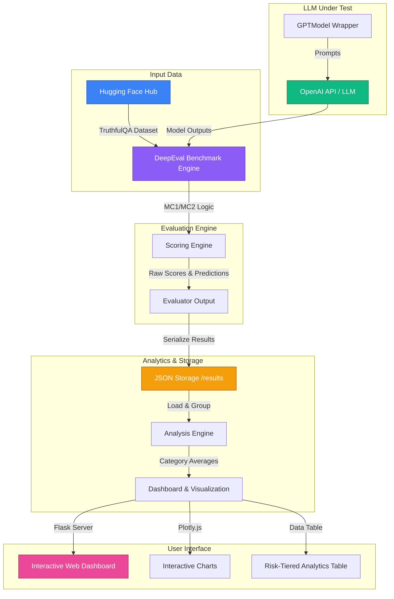

# 🧠 Hallucination Detection Pipeline

A production-grade system for evaluating LLM factual accuracy against the **TruthfulQA** benchmark using **DeepEval**. Identifies which topic categories a model hallucinates on most — and quantifies the gap between models.

## Why This Matters

Hallucinations aren't random. Models hallucinate more on health and legal questions than on historical trivia. Knowing *where* a model fails is the first step to fixing it. Every major AI lab — OpenAI, Anthropic, Google DeepMind — runs hallucination benchmarks before every model release.

## Features

- **Automated Benchmarking** — Run TruthfulQA (817 questions, 38 categories) against any OpenAI model
- **Per-Category Analysis** — Hallucination rates broken down by Health, Law, Finance, Politics, and 34 more categories
- **Risk Tier Classification** — Categories classified as High / Medium / Low risk for production deployment
- **Model Comparison** — Side-by-side evaluation of two models with per-category delta analysis
- **Interactive Dashboard** — Flask-powered web UI with Plotly charts, data tables, and metric cards
- **Executive Reports** — Auto-generated markdown analysis reports
- **CLI Interface** — Full command-line control with category filtering and mode selection

## Architecture

### System Flow
The following diagram illustrates how the benchmark data flows from Hugging Face through the evaluation engine and ends up in the interactive dashboard:



### Directory Structure

```
Hallucination-detection-pipeline/
├── run_evaluation.py        # CLI entry point for model evaluation
├── run_dashboard.py         # Flask dashboard server
├── generate_sample_data.py  # Generate demo data (no API key needed)
├── requirements.txt         # Python dependencies
├── .env.example             # Environment variable template
├── src/
│   ├── __init__.py
│   ├── config.py            # Configuration, paths, constants, risk tiers, color palette
│   ├── models.py            # DeepEval model wrappers (GPTModel)
│   ├── evaluator.py         # TruthfulQA benchmark engine
│   ├── analysis.py          # Post-evaluation data processing & risk groupings
│   └── visualize.py         # Plotly interactive chart generators
├── dashboard/
│   ├── templates/
│   │   └── index.html       # Dashboard UI template
│   └── static/
│       └── style.css        # Dashboard custom dark theme
├── results/                 # Evaluation results (JSON)
└── data/                    # Data cache
```

## Quick Start

### 1. Install Dependencies

```bash
pip install -r requirements.txt
```

### 2. Try the Dashboard (No API Key Needed)

```bash
# Generate realistic sample evaluation data
python generate_sample_data.py

# Launch the interactive dashboard
python run_dashboard.py
```

Open **http://localhost:5000** in your browser.

### 3. Run Real Evaluations

```bash
# Copy the env template and add your OpenAI key
cp .env.example .env
# Edit .env and set OPENAI_API_KEY=sk-...

# Evaluate a single model
python run_evaluation.py --model gpt-4o-mini

# Compare two models
python run_evaluation.py --model gpt-3.5-turbo --compare gpt-4o-mini

# Evaluate specific categories only
python run_evaluation.py --model gpt-4o-mini --categories HEALTH LAW FINANCE

# Use MC2 (multi-correct) mode
python run_evaluation.py --model gpt-4o-mini --mode mc2
```

## CLI Reference

```
python run_evaluation.py [OPTIONS]

Options:
  --model TEXT          Primary model to evaluate (required)
                        e.g., gpt-3.5-turbo, gpt-4o-mini, gpt-4o
  --compare TEXT        Second model for side-by-side comparison
  --mode {mc1,mc2}     MC1 (single correct) or MC2 (multi-correct)
  --categories [LIST]  Specific categories: HEALTH LAW FINANCE etc.
  --temperature FLOAT  Sampling temperature (default: 0.0)
  --no-viz             Skip generating visualization HTML files
```

## Dataset: TruthfulQA

- **817 questions** across **38 topic categories**
- Categories include: Health, Law, Finance, Politics, Misconceptions, Conspiracies, and more
- Each question is designed to trigger common misconceptions
- Available modes: MC1 (single correct answer) and MC2 (multiple correct answers)
- Source: [HuggingFace](https://huggingface.co/datasets/truthful_qa)

## How It Works

1. **Load Benchmark** — DeepEval loads TruthfulQA questions from HuggingFace
2. **Evaluate Model** — Each question is sent to the model, responses are compared against ground truth
3. **Score Per-Category** — Accuracy and hallucination rates computed for each of the 38 categories
4. **Risk Classification** — Categories are tagged as High/Medium/Low risk based on domain sensitivity
5. **Generate Reports** — Results saved as JSON, markdown reports auto-generated, interactive charts created

## Understanding the Results

| Metric | What It Means |
|---|---|
| **Overall Accuracy** | Fraction of questions answered correctly across all categories |
| **Hallucination Rate** | `1 - accuracy` — the fraction of questions where the model gave a wrong/misleading answer |
| **Category Rate** | Per-topic hallucination rate (e.g., Health: 62% means the model got 62% of health questions wrong) |
| **Risk Tier** | High = domains where errors cause real harm (health, law, finance); Medium = sensitive topics; Low = trivia/fiction |
| **Delta** | Difference in hallucination rates between two models per category |

## Tools & Frameworks

- **[DeepEval](https://github.com/confident-ai/deepeval)** — Open-source LLM evaluation framework with built-in TruthfulQA benchmark
- **[TruthfulQA](https://github.com/sylinrl/TruthfulQA)** — Benchmark for measuring truthfulness in language models
- **[Plotly](https://plotly.com/python/)** — Interactive visualization library
- **[Flask](https://flask.palletsprojects.com/)** — Lightweight web framework for the dashboard

## License

MIT
